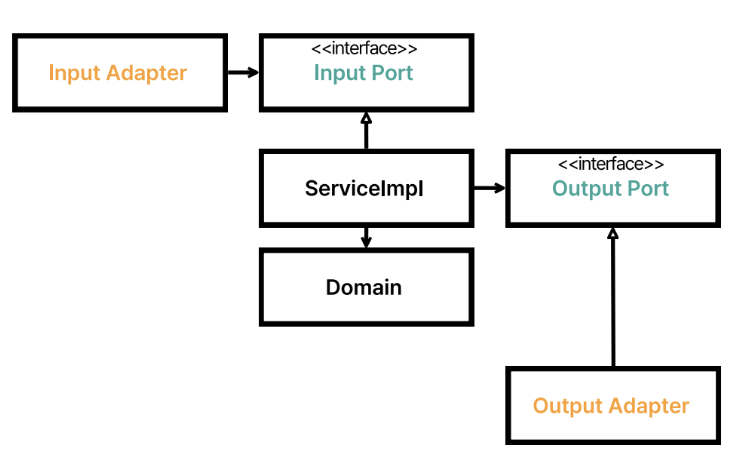
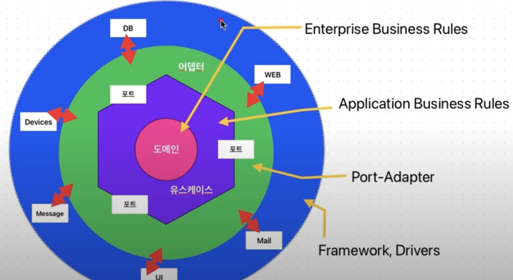

# 아키텍처

이 글은 레이어드 아키텍처와 헥사고날 아키텍처를 학습하여 개인적인 장,단점을 정리해보고 이 프로젝트에 왜 이런 결정을 내렸는지 정리하고 스스로 최소한의 컨벤션을 확립하기 위함이다.  

## TL;DR

레이어드 아키텍처의 단점은 계층간 기술 의존성 오염을 막지 않고 단일 서비스 구현으로 인해 유즈케이스가 노출되지 못한다는 점이다.  
헥사고날 아키텍처의 단점은 작성해야 할 코드양이 많다는 것과 애플리케이션의 복잡도가 높지 않으면 큰 효과를 보기 힘들 수 있다는 점이다.  
이 단점들을 모두 취합하여 아래와 같은 구조와 가이드라인을 결정하게 되었다. 구조는 아래와 같다.  

```
─ common
   ├── controller
   ├── holder
   ├── exception
   ├── error
   ├── infrastructure
   ├── utils
   └── ...
─ payment-service
   ├── controller
   │   └── port
   ├── service
   │   ├── domain
   │   ├── port
   │   └── exception
   └── infrastructure
       ├── jpa
       ├── exception
       ├── mapper
       └── webclient
─ user-service
   └── ...
─ item-service
   └── ...
─ wallet-service
   └── ...
```

1. 포트/어댑터를 in,out으로 구분하지 않고 port 인터페이스 패키지만 클라이언트 패키지에 위치시켜 의존성 역전 원칙을 통해 도메인 영역을 순수하게 만든다.
2. 자원에 대한 단일 서비스 클래스를 사용하지 않고 유즈케이스 별로 port 인터페이스와 service 구현체를 작성하여 유즈케이스를 노출시켜 불필요한 메서드에 의존하지 않도록 한다.
3. 또한 유즈케이스별로 요청과 응답을 각각 생성하여 불필요한 정보는 전달되지 않도록 한다.
4. 각 계층은 모델을 각각 관리하며, 각 레이어의 모델에 맞는 검증을 진행하여 의도를 잘 드러낼 수 있도록 한다.
    - controller의 request 모델은 입력 유효성 검증, service의 command 모델은 비즈니스 규칙 검증
5. 계층간 매핑 전략은 커맨드(변경) 요청인 경우 양방향 매핑 전략을 사용하며, 입력 규칙 또는 비즈니스 규칙이 복잡할 경우 커맨드 객체를 추가하여 책임과 목적을 명확히 한다.
    - 쿼리(읽기) 요청이 간단한 경우 웹 계층과 애플리케이션 계층 간 매핑은 생략하여 불필요한 매핑은 추가하지 않도록 한다. 
    - 기본적으로 도메인 계층과 영속성 계층은 항상 모델(엔티티)를 분리하여 기술적 의존성을 도메인 계층에 침범하지 않도록 한다.  
6. 각 계층이 관심가지는 예외를 각각 가지며, 공통 모듈의 예외를 상속받아 계층화하여 사용한다.

헥사고날 아키텍처의 구조를 그대로 따르기 보다는 레이어드 아키텍처의 기조를 따르되, 헥사고날 아키텍처의 장점 중 현재 필요한 부분만 차용하도록 하였다.  
특징으로는 service 계층에서 in/out을 구분하여 입력,출력에 대한 의존성을 관리하지 않아 service 계층에서는 controller/port와 infrastructure에 의존하는 특징이 있다.      

## 레이어드 아키텍처

```
웹 (컨트롤러) -> 비즈니스 (서비스) -> 영속성 (엔티티, 리포지토리)
```

위와 같이 의존성이 단방향, 상위에서 하위 계층으로 흐르는 이 아키텍처의 단점과 특징에 대해 알아보자.  

1. **데이터베이스 주도 설계를 유도한다.**
    - 가장 마지막에 의존하는 영속성 계층을 먼저 설계한 후에 이를 토대로 객체의 상태를 먼저 설계하게 된다.
    - 이런 데이터베이스 주도 설계는 데이터 중심 설계를 유발하며, 행동보다 데이터를 먼저 결정하게 되어 객체간 협력을 고려하기 어려워진다.
2. **계층간 참조 오염이 발생하기 쉽다.**
    - 위에서 아래로 순방향으로만 흐르고 역류하지 않도록 해야하며, 레이어를 건너뛰거나 특정 레이어를 제외하고는 동일 레이어를 참조하지 말아야 한다는 규칙이 있긴 하다.
    - 하위 레이어는 모두 접근 가능하다는 말이 되기에 비즈니스 레이어에서 필요한 헬퍼나 유틸리티 컴포넌트를 영속성 레이어에 밀어 넣는 오염을 일으키기 쉽다.
    - 아주 간단한 엔티티 조작을 요구하는 상황에 비즈니스 레이어를 건너뛰고 웹 레이어에서 영속성 레이어로 바로 접근하는 오염도 일으킬 수 있다.
3. **유스케이스를 숨긴다.**
    - 도메인 로직이 어디에도 존재할 수 있기 때문에 흩어지기 쉽다.
    - 여러 개의 유스케이스를 담당하는 괴물 서비스가 탄생하기 쉽다.

데이터베이스 주도 설계 문제는 역량 문제가 클 것이며, 계층간 오염 또는 유스케이스를 숨기는 문제는 대부분 철저한 코드 리뷰 또는 팀원간 지식 동기화를 통해 해결할 수 있다.  
개인적인 생각으로는 레이어드 아키텍처의 가장 큰 문제점은 **계층간 기술 의존성이 오염되기 쉽다는 것**이다.  
즉, 비즈니스 레이어 또는 도메인 레이어가 영속성 레이어에 직접 의존하여 영속성 레이어의 기술 의존성에 쉽게 노출되어 결합도가 높아진다는 것이다.  
결합도가 높아진다면 영속성 레이어에 변경이 일어난다면 비즈니스 로직을 관리하는 비즈니스, 도메인 레이어까지 변경의 영향이 온다는 것이다.  
  
이 문제를 헥사고날 아키텍처는 의존성 역전을 통해 해결한다.  

## 헥사고날 아키텍처



포트/어댑터 계층을 통해 의존성을 역전시켜 도메인 코드가 다른 바깥쪽 코드에 의존하지 않게 함으로써 영속성과 UI에 특화된 의존성들을 분리하는 것이다.  
모든 의존성이 도메인 코드로 향하도록 하여 도메인 코드 변경의 취약점을 제거하는 것이 핵심이다.  
아래와 같은 구조가 된다.  

```
root
 ├── adapter
 │   ├── in
 │   │   └── web
 │   └── out
 │       └── persistence
 ├── application
 │   ├── domain
 │   │   ├── model
 │   │   └── service
 │   └── port
 │       ├── in
 │       └── out
 └── common
     └── validation
```

계층간 완전한 의존성 격리를 위하여 멀티 빌드 모듈(`domain`, `infra`, `api` ... )로 헥사고날 아키텍처를 구성할 수도 있다.  



하지만 패키지 복잡도가 오르고 작성해야 할 코드의 양이 많아진다.  
무작정 적용하기 보다는 복잡한 도메인 로직을 가진 시스템에 고려해볼 수 있을 것이다.
