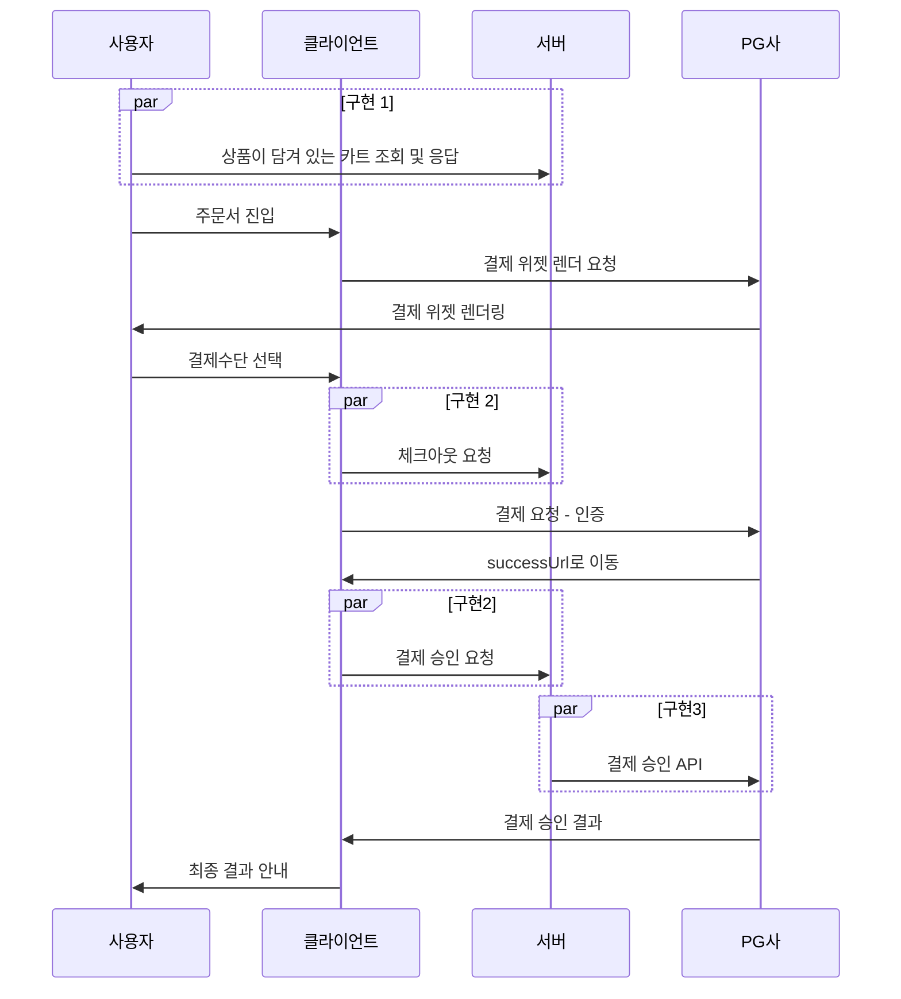
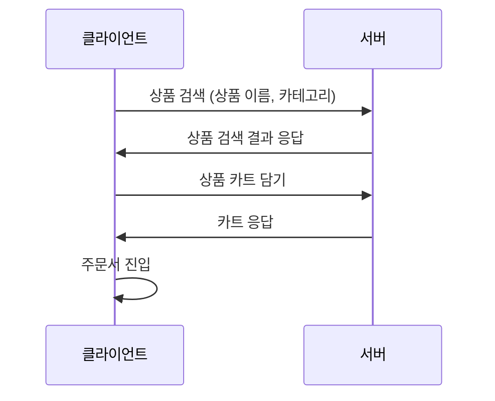
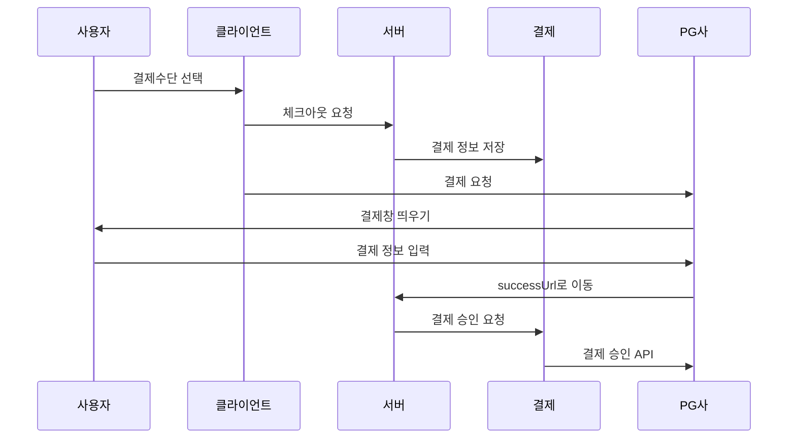
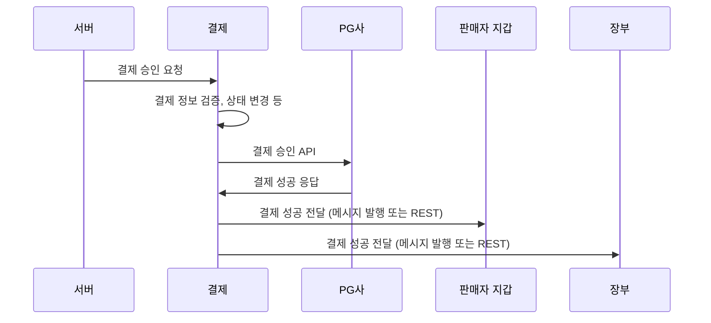
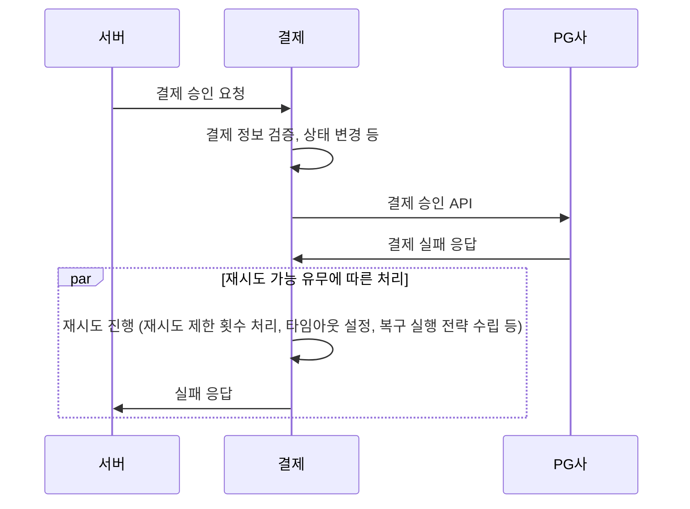

```mermaid
sequenceDiagram
    participant u as 사용자
    participant c as 클라이언트
    participant s as 서버
    participant pg as PG사
    
    par 구현 1
    u->>s: 상품이 담겨 있는 카트 조회 및 응답
    end
    u->>c: 주문서 진입
    c->>pg: 결제 위젯 렌더 요청
    pg->>u: 결제 위젯 렌더링
    u->>c: 결제수단 선택
    par 구현 2
    c->>s: 체크아웃 요청
    end
    c->>pg: 결제 요청 - 인증
    pg->>c: successUrl로 이동
    par 구현2
    c->>s: 결제 승인 요청
    end
    par 구현3
    s->>pg: 결제 승인 API
    end
    pg->>c: 결제 승인 결과
    c->>u: 최종 결과 안내
```

## 구현 1: 상품 검색 및 카트 주문

```mermaid
sequenceDiagram
    participant c as 클라이언트
    participant s as 서버
    
    c->>s: 상품 검색 (상품 이름, 카테고리)
    s->>c: 상품 검색 결과 응답
    c->>s: 상품 카트 담기
    s->>c: 카트 응답
    c->>c: 주문서 진입
```

## 구현 2: 체크아웃 및 결제

```mermaid
sequenceDiagram
    participant u as 사용자
    participant c as 클라이언트
    participant s as 서버
    participant p as 결제
    participant pg as PG사
    
    u->>c: 결제수단 선택
    c->>s: 체크아웃 요청
    s->>p: 결제 정보 저장
    c->>pg: 결제 요청
    pg->>u: 결제창 띄우기
    u->>pg: 결제 정보 입력
    pg->>s: successUrl로 이동
    s->>p: 결제 승인 요청
    p->>pg: 결제 승인 API
```

## 구현 3: 결제 상태에 따른 처리

### 결제 승인 성공

```mermaid
sequenceDiagram
    participant s as 서버
    participant p as 결제
    participant pg as PG사
    participant w as 판매자 지갑
    participant l as 장부

    s->>p: 결제 승인 요청
    p->>p: 결제 정보 검증, 상태 변경 등 
    p->>pg: 결제 승인 API
    pg->>p: 결제 성공 응답
    p->>w: 결제 성공 전달 (메시지 발행 또는 REST)
    p->>l: 결제 성공 전달 (메시지 발행 또는 REST)
```

### 결제 승인 에러

```mermaid
sequenceDiagram
    participant s as 서버
    participant p as 결제
    participant pg as PG사

    s->>p: 결제 승인 요청
    p->>p: 결제 정보 검증, 상태 변경 등 
    p->>pg: 결제 승인 API
    pg->>p: 결제 실패 응답
    par 재시도 가능 유무에 따른 처리
    p->>p: 재시도 진행 (재시도 제한 횟수 처리, 타임아웃 설정, 복구 실행 전략 수립 등) 
    p->>s: 실패 응답
    end
```
